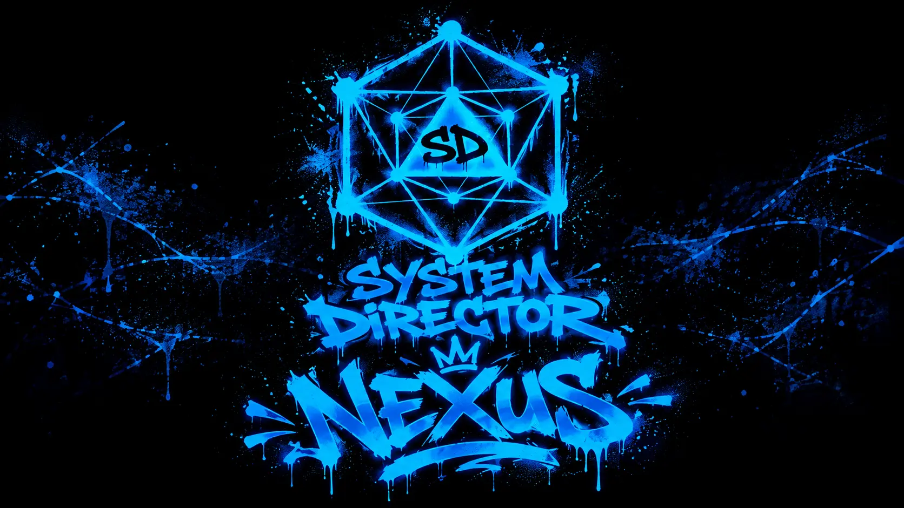

<p align="center"></p>

# System Director

## 0.19.0 — Languages and Effect Applier

- Custom world languages with per-player language selection and fallback chains.
- Translation editing for widget labels, titles, descriptions, hints, placeholders and dialogue text while technical values remain stable.
- Translation metadata is preserved in sheet templates, exports, imports and Market packages.
- Effect Applier library for creating reusable ActiveEffect presets and applying them to selected tokens.
- Optional player access to Effect Applier for owned actors.

<p align="center">
  <a href="https://discord.gg/Qfx5y8cPCw"></a>
  <a href="https://www.donationalerts.com/r/pronikxside"></a>
</p>
<p align="center">
  
  
  
  
</p>

System Director is a visual, system-agnostic toolkit for building tabletop rules in Foundry VTT. Create Actor and Item sheets, bind widgets to document paths, and automate rules with a typed node graph.

## Install

1. Foundry Setup → **Game Systems** → **Install System**.
2. Paste:
   ```text
   https://github.com/phoenix1cold/system-director/releases/latest/download/system.json
   ```
3. Click **Install**, then create a world using **System Director**.

Manual installation: extract the release `system.zip` into `<FoundryUserData>/Data/systems/sd/`. The folder must contain `system.json` at its root.

## Main features

- **Sheet Builder** — tabs, rows, cells, reusable templates and more than thirty widget types.
- **Widget Builder** — grid positioning, resizing, images, layers, nested widgets and safely scoped CSS.
- **Typed Node Graph** — Unreal-style pin language: every type has its own color, glyph and connector shape; arrays use stacked sockets and dashed wires.
- **Composable node library** — unified actor selection and item actions, explicit type-conversion nodes, machine-readable legacy replacement chains, and hidden duplicate nodes retained for saved-graph compatibility.
- **Consistent graph insertion** — dropping a dragged wire on empty canvas opens the same searchable category menu as right-click and automatically connects the selected compatible node.
- **Native Foundry windows** — graph editing, widget settings, interactables, function management, AI graph assistance and generated dialogue now use Foundry v14 ApplicationV2 frames with native movement, resize, minimize and independent z-order.
- **Composable rolls** — Roll → Analyze Roll → Compare Roll → Present Roll; formula and dice-pool modes.
- **Combat automation** — saves, damage, healing, targets, chat actions, AoE and auras.
- **Equipment** — inventory, slots, auto-equip and Active Effects that follow equipped state.
- **Quests** — quest logs, objectives, dependencies, visibility, rewards and quest events.
- **Progression** — class levels, choices, field changes, granted items/effects and skill trees.
- **Persistent typed databases** — one shared schema with per-Actor, per-Item and world values, available from every graph.
- **World-safe AOE presets** — ownerless graphs fall back to World storage, and typed AOE arrays pass intact through Database Set/Get into Spell.
- **Dialogue Builder** — visible Dialogue palette category with RPG dialogue, form prompts, portraits, dynamic choice exec outputs, values and conversation history.
- **Persistent widget values** — every keyed widget stores its current value in `system.widgetFields.<key>.value`; Select keeps this state independently from an optional Data Path, and Get Widget Value accepts a dynamic Widget Key.
- **Macros** — copy Dice and Skill widgets to Foundry Script Macros or build reusable graph macros.
- **Foundry v14 integration** — ApplicationV2, native Rich Text and Region-based area templates. Measured Templates are retained only as a v13 compatibility path.

## Documentation

The GitHub Pages wiki is task-oriented and includes click-by-click instructions:

- [Getting started](https://phoenix1cold.github.io/system-director/getting-started.html)
- [Sheets and widgets](https://phoenix1cold.github.io/system-director/sheets.html)
- [Node Graph guide](https://phoenix1cold.github.io/system-director/node-graph.html)
- [Quest system](https://phoenix1cold.github.io/system-director/quests.html)
- [Progression](https://phoenix1cold.github.io/system-director/progression.html)
- [Equipment](https://phoenix1cold.github.io/system-director/equipment.html)
- [AoE, Aura and Effects](https://phoenix1cold.github.io/system-director/areas-effects.html)
- [Macros](https://phoenix1cold.github.io/system-director/macros.html)
- [Node recipes](https://phoenix1cold.github.io/system-director/examples.html)
- [Widget reference](https://phoenix1cold.github.io/system-director/widgets.html)
- [Node reference](https://phoenix1cold.github.io/system-director/nodes.html)

## Updating safely

Back up the world before replacing a system version. Existing hidden legacy nodes remain executable so previously saved graphs continue to work. Test important sheets, equipment effects and quest rewards on a world copy before updating a live campaign.

## Support

- Discord: https://discord.gg/Qfx5y8cPCw
- Issues: https://github.com/phoenix1cold/system-director/issues
- Wiki: https://phoenix1cold.github.io/system-director/
- Donations: https://www.donationalerts.com/r/pronikxside

See [LICENSE](LICENSE) for usage terms.
